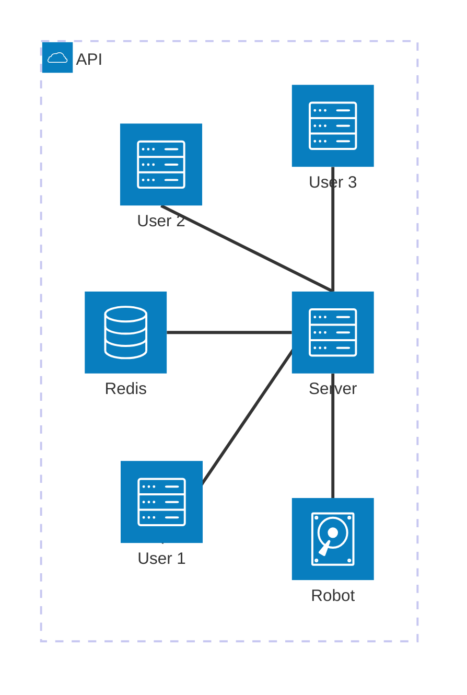

# Toy Robot Simulator
#### _A showcase of expanding possibilities from a simple problem_
# Overview
## Problem Statement

The application is a simulation of a toy robot moving on a square tabletop, of dimension 5x5 units. 
- There are no other obstructors on the table surface.
- The robot is free to roam around the space of the table.
- The robot must be prevented from falling to destruction.
- Any movement that would result in the robot falling from the table must be prevented
- However further valid movement commands must still be allowed.

## Additional Requirements

- The application core function must be highly customizable.
- The application should be well tested
- The application should be performant
- If new type of integration is needed, implementation should not be too difficult.

# Implementation Consideration

- Choosing multiple implementation patterns such as Polymorphism and Repository pattern. 
  This is to make the application highly extensible.
- Implement unit tests for all components. 
  Also implement integration tests to ensure the application is compatible with multiple interfaces.
- Execute a performance benchmark to establish a baseline and compare it to the norms
- Implements a generator pattern for easy and quick maintenance process.
- Use session based processing to maintain cross-entrypoint compatibility.
- Use session locking to prevent race condition.

# System Architecture

